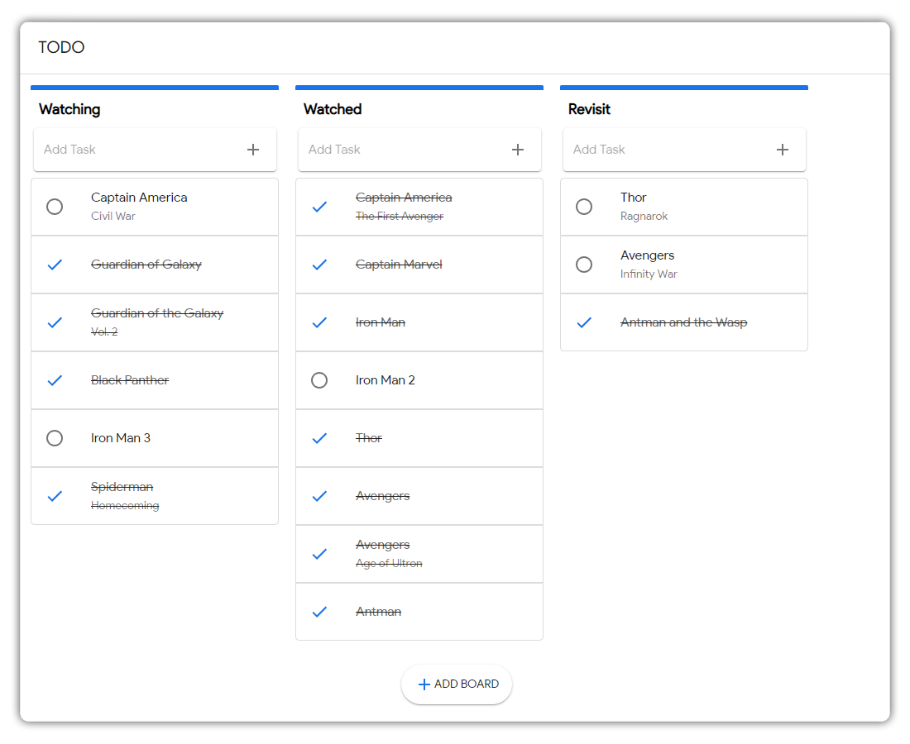

# Todo App

This is a ReactJS based Todo application which only works in local for now. In the future maybe, I will create a web version and sync using web sockets.

<!--  -->
<p align="center">
	
</p>

## Stack:
- ReactJS
- Redux
- CSS
- JSX
- Material UI

## Installation

```bash
	$	yarn install
	$	yarn start
```

### Future:
- Way to Save the states for storing the sessions.
- Restructing the code of components vs containers
- Fix the react styles to CSS only or SCSS
- Make it real time with Websockets.

### Contributions are appreciated.

